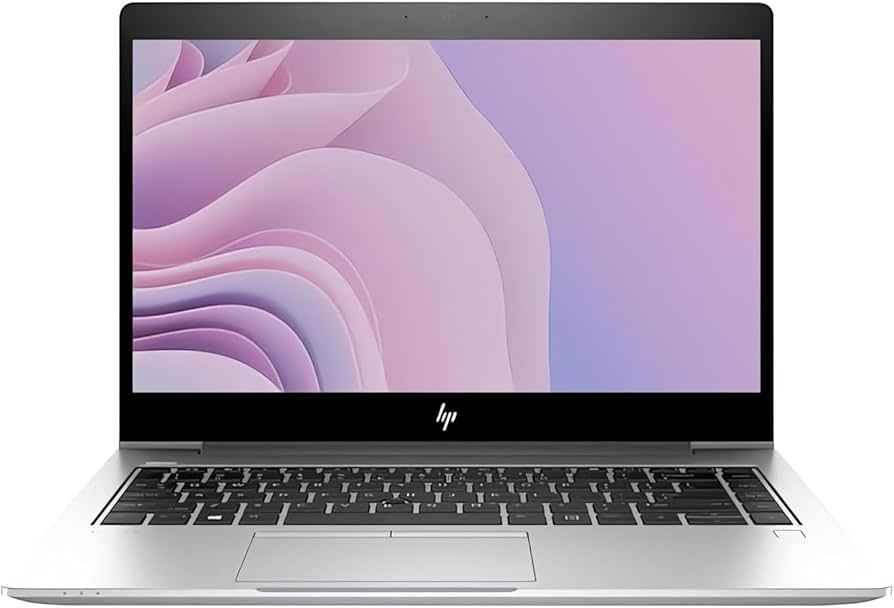
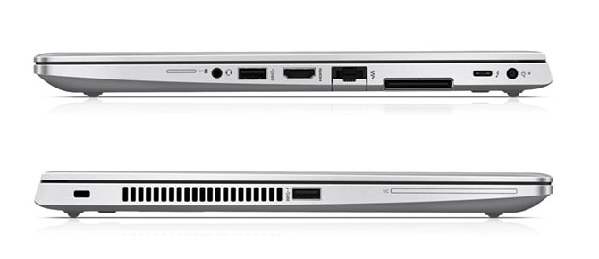
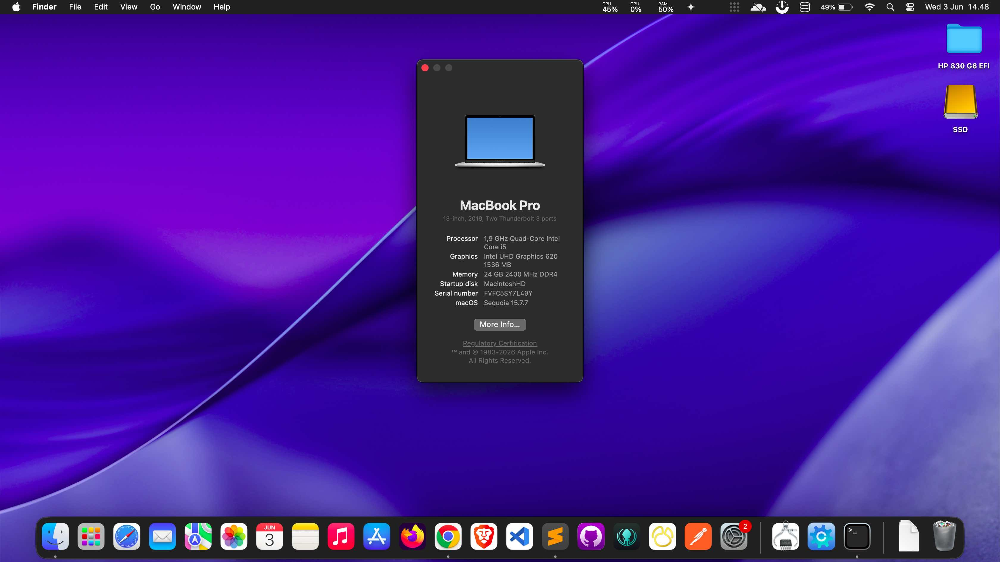

# HP Elitebook 830 G6




## Information

- Intel i5-8365U with UHD 620
- 16 GB DDR4
- Samsung 970 EVO Plus 1TB NVMe SSD
- AX200 wifi / bluetooth
- Tested on MacOS Sequoia 15.7.7




## What Works

- CPU and iGPU
- Camera
- Speakers /  Headphones input and output
- Trackpad & Button
- Joystick Mouse
- USB Ports (Including USB-C Port)
- LAN / Ethernet
- Fn keys
- Battery Status
- Wi-Fi / Bluetooth
- HDMI output ( HDMI - Type-C -TB3 )
- Sleep, Restart, Shutdown


## BIOS Settings

- You can enable Fastboot, VTd and VTx
- Disable Legacy boot and Secure boot
- iGPU Memory (DVMT) set to 64MB
- disable wake on LAN/USB whatever for sleep to work

## Post Boot

### Disable hibernation by follow steps:

```bash
sudo rm /var/vm/sleepimage
sudo pmset -a hibernatemode 0
sudo mkdir /var/vm/sleepimage
sudo pmset -a standby 0
sudo pmset -a autopoweroff 0
```
### Enable Audio
- Disable SIP first, (Press space on Opencore boot picker and select Toggle SIP)
```bash
cd ./Post-Boot
sudo cp -R VoodooHDA.kext /Library/Extensions/
sudo cp -R VoodooHDA.prefPane /Library/PreferencePanes/
```

### Enable HiDPI (Retina Display Scale)
- open Terminal
```bash
bash -c "$(curl -fsSL https://raw.githubusercontent.com/xzhih/one-key-hidpi/master/hidpi.sh)"
```
- hidpi.sh (included)
- Enable HiDPI
- Select Macbook Pro
- Write default display resolution: 1920x1080
- reboot
- open System Settings > Displays, if success, Retina Scale will be show


## Thanks to:
- Acidanthera, VGerris, CloverHackyColor, etc.